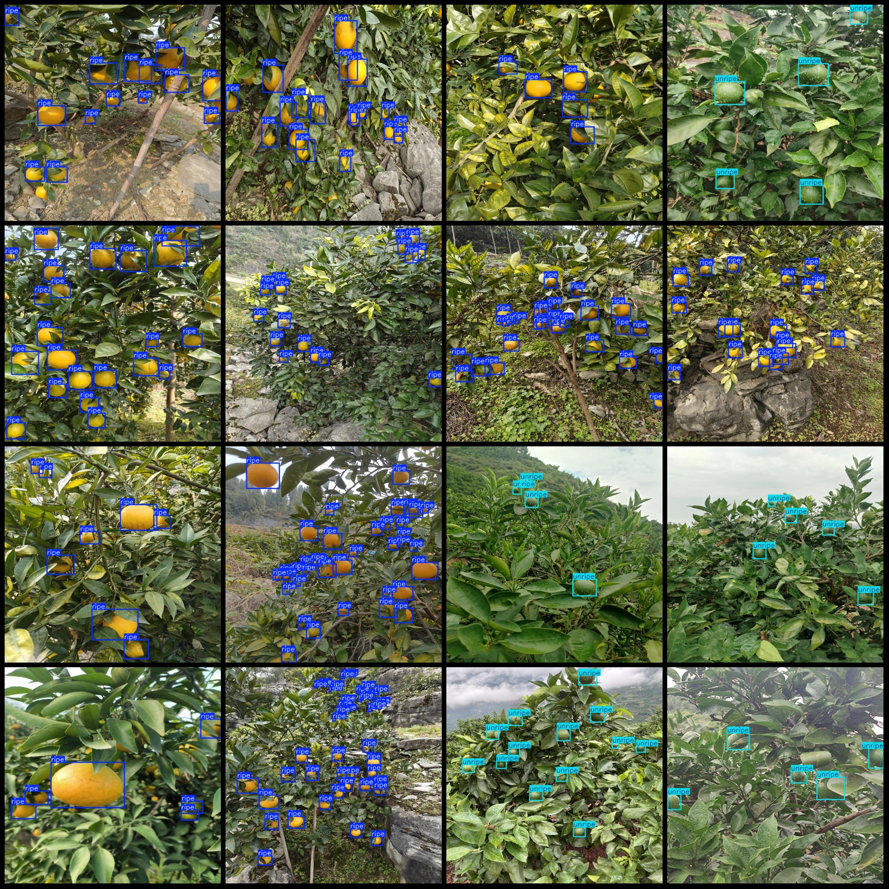
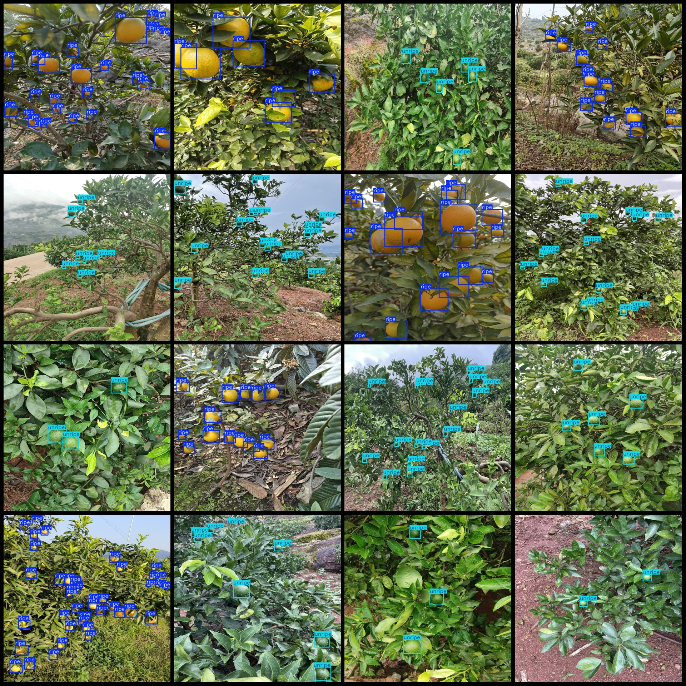

# Intelligent Orchard Tree Orange Maturity Detection Dataset (VOC+YOLO) - 1566 Images, 2 Classes

Dataset format: Pascal VOC format + YOLO format (without split path in txt file, only containing jpeg images and corresponding VOC format xml files and yolo format txt files)

Number of images (jpg file count): 1566
Number of annotations (xml file count): 1566
Number of annotations (txt file count): 1566
Number of annotation categories: 2
Annotation category names (note that the order of labels in yolo format does not correspond to this, but refer to the classes.txt folder for the correct order): ["ripe", "unripe"]
Each category has a number of bounding boxes:
"ripe" bounding box count = 16806
"unripe" bounding box count = 5465
Total bounding box count: 22271
Each category occupies a number of images:
"ripe" occupies images = 790
"unripe" occupies images = 780
Image resolution: 640x640
Annotation tool used: labelImg
Annotation rules: draw bounding boxes for categories
Important note: The dataset does not include partitions for training, validation, or testing. Users are required to manually divide the dataset.
Special declaration: This dataset does not guarantee the accuracy of the trained models or weights files.
Image preview:
Annotation example:

## Picture

Here is a pay link on Stripe ( https://buy.stripe.com/3cs8yP7sY87d0vu9AB ). Please contact me lonlonago@foxmail.com after funding $89, and I will send you a complete data files , thank you!

